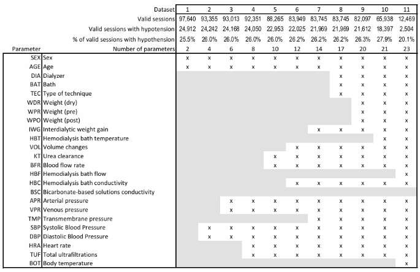
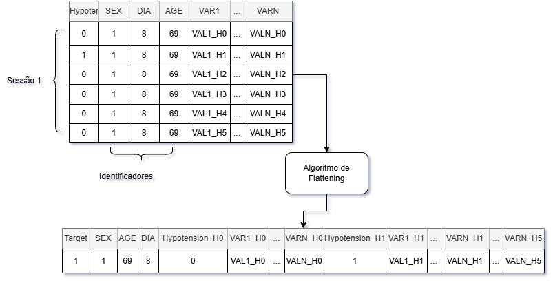

# Dashboard - Predição de casos de hipotensão intradiálica

> Trabalho de Conclusão de Curso — Predição de hipotensão intradiálica em sessões de hemodiálise via aprendizado supervisionado e simulação de trajetória clínica.

---

## Sumário

1. [Visão Geral](#visão-geral)
2. [Dependências e Instalação](#dependências-e-instalação)
3. [Demonstração do Dashboard](#demonstração-do-dashboard)
4. [Estrutura do Projeto](#estrutura-do-projeto)
5. [Fonte dos Dados](#fonte-dos-dados)
6. [Descrição dos Atributos](#descrição-dos-atributos)
7. [Metodologia](#metodologia)
8. [Modelos Disponíveis](#modelos-disponíveis)
9. [Descrição dos Arquivos](#descrição-dos-arquivos)
10. [Referências](#referências)

---

## Visão Geral

A **hipotensão intradiálica** (IDH — *Intradialytic Hypotension*) é a complicação mais frequente em sessões de hemodiálise, afetando pacientes com insuficiência renal crônica. Este projeto desenvolve um pipeline completo — da exploração e pré-processamento dos dados até a implantação de um dashboard interativo — para **prever episódios de hipotensão** com base em sinais clínicos medidos ao longo da sessão.

### Fluxo geral

```
dataset.csv  →  [TCC_1: Pré-processamento]  →  dataset_flat_V2.csv
                                                       ↓
                                          [TCC_3: Treinamento]  →  models_V2/*.pkl
                                                       ↓
                                          [src/dashboard.py]  →  Predição interativa
```

### Destaques técnicos

- **Simulação de horas faltantes** por *KNN de Trajetória com Ponderação por Distância*: dado que o usuário insere apenas H0 (ou H0+H1), o sistema estima as horas restantes buscando sessões historicamente similares no dataset.
- **Separação por tipo de variável**: variáveis numéricas são imputadas por média ponderada dos K vizinhos; variáveis categóricas (BAT_GROUP) são propagadas por *carry-forward*, preservando a semântica one-hot.
- **Suporte a múltiplos modelos**: SVM, Random Forest, XGBoost, KNN, Decision Tree, MLP e Naive Bayes.
- **Dashboard Streamlit** com visualizações Plotly, exportação CSV e seleção interativa de parâmetros.

---

## Dependências e Instalação

### Pré-requisitos

- Python **3.10+**
- `git`

### Opção 1 — Ambiente virtual (`venv`) *(recomendado)*

```bash
# 1. Clone o repositório
git clone https://github.com/CBenini07/TCC.git
cd TCC

# 2. Crie e ative o ambiente virtual
python -m venv .venv

# Windows (PowerShell)
.venv\Scripts\Activate.ps1

# macOS / Linux
source .venv/bin/activate

# 3. Instale as dependências
pip install -r requirements.txt

# 4. Execute o dashboard
streamlit run src/dashboard.py
```

### Opção 2 — Instalação direta (sem venv)

```bash
pip install -r requirements.txt
streamlit run src/dashboard.py
```

O dashboard abrirá automaticamente em `http://localhost:8501`.

> **Atenção:** os arquivos `data/dataset_flat_V2.csv` e a pasta `models_V2/` devem estar presentes na raiz do projeto. Caso os modelos não estejam incluídos no repositório por restrição de tamanho, execute os notebooks `TCC_1` e `TCC_3` em sequência para gerá-los.

---

## Demonstração do Dashboard

[](https://youtu.be/pGQkAoc_pig)
(basta clicar para ser redirecionado ao vídeo)

### Passo a passo de uso

**1. Configure os dados do paciente na barra lateral**

| Campo | Descrição |
|---|---|
| **Sex** | Sexo biológico (Female / Male) |
| **Age** | Idade em anos |
| **Dialyzer (DIA)** | Tipo de dializador utilizado na sessão (lista com 26 opções) |

**2. Selecione o modelo e os parâmetros de simulação**

- Escolha um dos 7 modelos pré-treinados disponíveis em `models_V2/` - Recomenda-se o `models_V2\modelo_knn.pkl` por possuir a maior taxa de precisão (Taxa de identificações positivas realmente corretas).
- Ajuste o slider **K-Neighbors** (padrão: 10) — quantidade de sessões históricas usadas para estimar horas faltantes.
- Marque/desmarque **"Include demographics in distance"** para incluir ou excluir SEX e AGE no cálculo de similaridade.

**3. Ative as horas que deseja preencher manualmente**

- Os checkboxes `H0` a `H5` no topo da grade controlam quais horas serão inseridas.
- **H0 é obrigatória.** H1–H5 são opcionais — horas não marcadas serão simuladas automaticamente.

**4. Preencha os valores clínicos**

- **Parâmetros Numéricos**: WDR, WPR, WPO, IWG, SBP, DBP, APR, VPR, TMP, BFR, KT, TUF, HBC — um valor por hora habilitada.
- **Bath Group**: selecione o grupo do banho (ACF 3A5 / EuCliD / Demais classes) para cada hora habilitada. O grupo é propagado automaticamente para as horas não preenchidas (*carry-forward*).

**5. Clique em "▶ Simulate & Predict"**

O app executa:
1. Simulação KNN das horas faltantes para variáveis numéricas.
2. Propagação carry-forward para variáveis categóricas (BAT_GROUP).
3. Montagem do vetor de entrada no formato `dataset_flat_V2.csv`.
4. Predição pelo modelo selecionado.

**6. Interprete os resultados**

- **Alerta colorido**: ⚠️ ALTO RISCO (TARGET = 1) ou ✅ BAIXO RISCO (TARGET = 0).
- **Gauge de probabilidade**: P(TARGET = 1) com faixas de interpretação clínica.
- **Tabela H0–H5**: valores observados (🔵), simulados por KNN (🟢) e propagados (🟠).
- **Gráficos de trajetória**: séries temporais por grupo clínico (Hemodinâmica, Pressões, Pesos etc.).

**7. Exporte o relatório**

Clique em **"⬇ Download CSV Report"** para salvar um arquivo com todos os valores (origem, hora, valor, probabilidade de predição).

**Opção alternativa — Upload de CSV**

Na barra lateral, faça upload de um `.csv` no mesmo formato de `data/dataset_flat_V2_input_dashboard.csv` para pré-preencher os campos automaticamente.

---

## Estrutura do Projeto

```
TCC/
│
├── data/
│   ├── dataset.csv                          # Dataset original (Mendeley)
│   ├── dataset_selected.csv                 # Subconjunto 7 (benchmark)
│   ├── dataset_flat.csv                     # Saída do TCC_2 (benchmark)
│   ├── dataset_flat_V2.csv                  # Saída do TCC_1 (dataset principal)
│   └── dataset_flat_V2_input_dashboard.csv  # Exemplo de input via CSV
│
├── imgs/
│   ├── subdatasets.png                      # Figura: subconjuntos disponíveis
│   └── Flat_Process.drawio.png              # Figura: processo de flattening
│
├── models/                                  # Modelos treinados no TCC_2 (benchmark)
│   ├── modelo_DT.pkl
│   ├── modelo_knn.pkl
│   ├── modelo_MLP.pkl
│   ├── modelo_NB.pkl
│   ├── modelo_RF.pkl
│   ├── modelo_svm.pkl
│   └── modelo_xgboost.pkl
│
├── models_V2/                               # Modelos treinados no TCC_3 (principal)
│   ├── modelo_DT.pkl
│   ├── modelo_knn.pkl
│   ├── modelo_MLP.pkl
│   ├── modelo_NB.pkl
│   ├── modelo_RF.pkl
│   ├── modelo_svm.pkl
│   └── modelo_xgboost.pkl
│
├── src/
│   └── dashboard.py                         # Dashboard Streamlit
│
├── TCC_1_Analise_Exploratoria.ipynb         # Pré-processamento e flattening
├── TCC_2_Aplicacao_modelos.ipynb            # Benchmark (subconjunto 7)
├── TCC_3_Aplicacao_Modelos_V2.ipynb         # Treinamento principal (V2)
├── requirements.txt
├── .gitignore
└── README.md
```

---

## Fonte dos Dados

O dataset utilizado é o [**Dialysis database: sessions with valid data of clinical parameters**](https://data.mendeley.com/datasets/7kmtsmsgfw/1), disponibilizado publicamente no repositório Mendeley Data pelos autores do artigo de referência.

Os dados foram coletados no **Hospital Príncipe de Asturias** (Madrid, Espanha) entre **2016 e 2019**, abrangendo:

- **758 pacientes** submetidos a tratamento de hemodiálise;
- **~98.015 sessões** de hemodiálise;
- Até **22 parâmetros clínicos** medidos em seis momentos distintos (H0–H5);
- Informações demográficas de sexo e idade.

### Definição do target

Episódios de **hipotensão intradiálica** foram identificados pela queda da pressão arterial sistólica ≥ 20 mmHg entre os períodos iniciais e intermediários da sessão. Com base nesse critério, temos as seguintes estatísticas para o dataset antes do pré-processamento:

| | Quantidade | % |
|---|---|---|
| Sessões com hipotensão (TARGET = 1) | ~25.026 | ~26% |
| Sessões sem hipotensão (TARGET = 0) | ~72.989 | ~74% |
| Pacientes com ao menos um episódio | 584 | ~77% |

### Subconjuntos disponíveis

O autor disponibilizou os dados em subconjuntos já anonimizados (sem ID e sem data) e pré-processados (sem valores nulos e sem outliers extremos).



Neste projeto foram utilizados:

- **Subconjunto 1** (`dataset.csv`): 97.640 sessões com SEX e AGE válidos — objeto de estudo do `TCC_1` para pré-processamento e geração do `dataset_flat_V2.csv`.
- **Subconjunto 7** (`dataset_selected.csv`): utilizado em `TCC_2` para benchmark sem pré-processamento aprofundado.

---

## Descrição dos Atributos

| Sigla | Parâmetro | Unidade |
|---|---|---|
| SEX | Sexo | Male / Female |
| AGE | Idade | anos |
| DIA | Dializador | adimensional |
| BAT | Banho | adimensional |
| TEC | Tipo de técnica | adimensional |
| WDR | Peso (seco) | Kg |
| WPR | Peso (pré-diálise) | Kg |
| WPO | Peso (pós-diálise) | Kg |
| IWG | Ganho de peso interdialítico | Kg |
| HBT | Temperatura do banho de hemodiálise | °C |
| VOL | Alterações de volume | L |
| KT  | Depuração de ureia | L |
| BFR | Fluxo sanguíneo | mL/min |
| HBF | Fluxo do banho de hemodiálise | mL/min |
| HBC | Condutividade do banho de hemodiálise | mScm |
| BSC | Condutividade das soluções à base de bicarbonato | mScm |
| APR | Pressão arterial | mmHg |
| VPR | Pressão venosa | mmHg |
| TMP | Pressão transmembrana | mmHg |
| SBP | Pressão arterial sistólica | mmHg |
| DBP | Pressão arterial diastólica | mmHg |
| HRA | Frequência cardíaca | bpm |
| TUF | Ultrafiltrações totais | mL |
| BOT | Temperatura corporal | °C |

---

## Metodologia

### 1. Pré-processamento (`TCC_1_Analise_Exploratoria.ipynb`)

- Análise estatística e visual de atributos numéricos e categóricos.
- Remoção de zeros artificiais inseridos pelo autor no dataset original.
- Remoção de outliers.
- Seleção de atributos com base em correlação com o Target e qualidade dos dados.
- Imputação de valores faltantes com **KNN Imputer** (somente variáveis numéricas).
- **Flattening** das tuplas: cada sessão de 6 linhas é convertida em uma única linha.

### 2. Flattening

Os algoritmos de aprendizado supervisionado clássicos não processam naturalmente estruturas temporais. O *flattening* converte cada sessão de hemodiálise (que originalmente ocupava 6 linhas, uma por hora) em **um único vetor de características**, dispondo os valores de H0 a H5 lado a lado:

```
SEX, AGE, DIA, var1_H0, var1_H1, ..., var1_H5, var2_H0, ..., varN_H5
```

O atributo alvo `Target` é definido como `1` se ao menos uma das seis linhas originais da sessão registrar hipotensão; caso contrário, `0`.



### 3. Simulação de horas faltantes — KNN de Trajetória

No dashboard, o usuário pode inserir apenas H0 (ou qualquer subconjunto de horas). Para completar o vetor de entrada do modelo, aplica-se uma estratégia de **KNN de Trajetória com Ponderação por Distância**:

1. Monta-se um vetor de busca com as horas **observadas** (+ SEX e AGE, opcionalmente).
2. Normaliza-se o vetor e busca-se os **K vizinhos mais próximos** no `dataset_flat_V2.csv`.
3. As horas faltantes são estimadas como **média ponderada pelo inverso da distância** dos K vizinhos.

> ⚠️ Variáveis categóricas (`BAT_GROUP_*`) **não** são imputadas por KNN. Em vez disso, utiliza-se *carry-forward* do último valor observado, preservando a semântica binária da codificação one-hot.

### 4. Treinamento dos modelos (`TCC_3_Aplicacao_Modelos_V2.ipynb`)

- Holdout estratificado 80/20 pelo atributo Target.
- Otimização de hiperparâmetros por `RandomizedSearchCV` ou `GridSearchCV`.
- Avaliação por: Acurácia, Precisão, F1-Score e AUC (área sob a curva ROC).


---

## Modelos Disponíveis

Os modelos pré-treinados em `models_V2/` são selecionáveis diretamente no dashboard:

| Modelo | Arquivo |
|---|---|
| K-Nearest Neighbor | `modelo_knn.pkl` |
| Random Forest | `modelo_RF.pkl` |
| Support Vector Machine | `modelo_svm.pkl` |
| XGBoost | `modelo_xgboost.pkl` |
| Decision Tree | `modelo_DT.pkl` |
| Multi-Layer Perceptron | `modelo_MLP.pkl` |
| Naive Bayes | `modelo_NB.pkl` |

Os modelos da pasta `models/` foram gerados no `TCC_2` sobre o subconjunto 7 e servem apenas como benchmark comparativo.

---

## Descrição dos Arquivos

| Arquivo | Entrada | Saída | Descrição |
|---|---|---|---|
| `TCC_1_Analise_Exploratoria.ipynb` | `data/dataset.csv` | `data/dataset_flat_V2.csv` | Análise exploratória, pré-processamento e flattening |
| `TCC_2_Aplicacao_modelos.ipynb` | `data/dataset_selected.csv` | `data/dataset_flat.csv`, `models/` | Benchmark com subconjunto 7 sem pré-processamento aprofundado |
| `TCC_3_Aplicacao_Modelos_V2.ipynb` | `data/dataset_flat_V2.csv` | `models_V2/` | Treinamento e avaliação dos modelos principais |
| `src/dashboard.py` | `data/dataset_flat_V2.csv`, `models_V2/` | — | Dashboard Streamlit interativo |
| `data/dataset_flat_V2_input_dashboard.csv` | — | — | Exemplo de input via CSV para o dashboard |

---

## Referências

- **Dataset**: Perez-Cisneros, M. et al. *Dialysis database: sessions with valid data of clinical parameters*. Mendeley Data, v1. [https://data.mendeley.com/datasets/7kmtsmsgfw/1](https://data.mendeley.com/datasets/7kmtsmsgfw/1)
- Streamlit — [https://streamlit.io](https://streamlit.io)
- scikit-learn — [https://scikit-learn.org](https://scikit-learn.org)
- XGBoost — [https://xgboost.readthedocs.io](https://xgboost.readthedocs.io)
- Plotly — [https://plotly.com/python](https://plotly.com/python)

---

> *Este projeto é desenvolvido como Trabalho de Conclusão de Curso. Todas as predições geradas pelo dashboard são ferramentas de apoio à decisão clínica e devem ser interpretadas por profissionais de saúde qualificados.*
